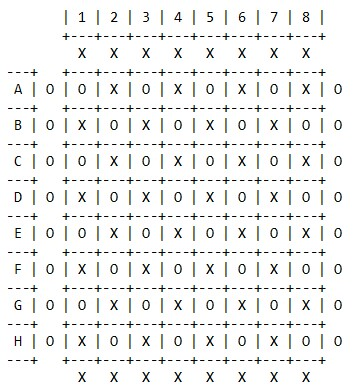
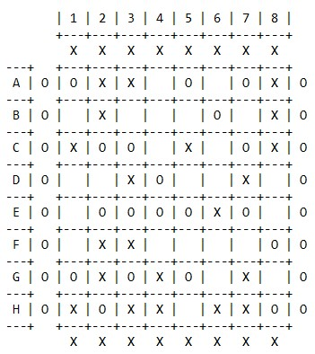
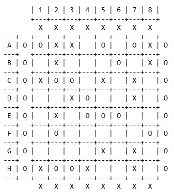

# Talpa

## T6 Talpa_1
| Name             | Number    | E-Mail               |
| ---------------- | --------- | ---------------------|
| Ana Teresa Feliciano da Cruz  | 201806460 | up201806460@fe.up.pt |
| André Filipe Meireles do Nascimento | 201806461 | up201806461@fe.up.pt |

---

## Installation and Execution

Execute SICStus, click on `File`, then `Consult`, and select the file `talpa.pl`. On the SICStus console type `play.` and press enter.

## Game Description 

Talpa is a 2-players game that belongs to Connection Games family. It is played on a square board with variable size, usually, it is a 8 x 8 board. While in most connection games players try to make a chain built of their pieces, in Talpa players remove pieces to make a path of empty spaces.

The goal is to make a path that connects both player sides, marked by the player's character, of the board.

### Rules

Initially, the board is filled with blue and red pieces, forming a checkerboard pattern. A player moves by picking up one of his pieces and capturing an orthogonally adjacent opponent's piece. The captured piece is removed from the board and replaced by the capturing piece. The capture is mandatory if possible. When capturing becomes impossible, players remove one of their pieces per turn. A player loses the game immediately if he makes a move that opens the path for the other player.

No draws are possible in Talpa.

---

[Description](https://www.boardgamegeek.com/boardgame/80657/talpa) | [Rules](https://nestorgames.com/rulebooks/TALPA_EN.pdf) | [Buy](https://nestorgames.com/#talpa_detail)

---

## Game Logic

### Game State Representation

#### **Board**

The board is represented by a list of sublists, each sublist is a row of the board. On each place of the board exists one out of three characters:

- `1` - Red player's piece
- `-1` - Blue player's piece
- `0` - empty cell to create a path to victory!
- `2` - the auxiliary character for Flood Fill, filling empty spaces

##### **Possible GameStates**

**Initial:**

```
initialGameState([
    [1,-1,1,-1,1,-1,1,-1],
    [-1,1,-1,1,-1,1,-1,1],
    [1,-1,1,-1,1,-1,1,-1],
    [-1,1,-1,1,-1,1,-1,1],
    [1,-1,1,-1,1,-1,1,-1],
    [-1,1,-1,1,-1,1,-1,1],
    [1,-1,1,-1,1,-1,1,-1],
    [-1,1,-1,1,-1,1,-1,1]
]).
```

**Mid game:**

```
midGameState([
    [1,-1,-1,0,1,0,1,-1],
    [0,-1,0,0,0,1,0,-1],
    [-1,1,1,0,-1,0,1,-1],
    [0,0,-1,1,0,0,-1,0],
    [0,1,1,1,1,-1,1,0],
    [0,-1,-1,0,0,0,0,1],
    [1,-1,1,-1,1,0,-1,0],
    [-1,1,-1,-1,0,-1,-1,1]
]).
```

**End game:**

(representing RED victory)

```
finalGameState([
    [1,-1,-1,0,1,0,1,-1],
    [0,-1,0,0,0,1,0,-1],
    [-1,1,1,0,-1,0,-1,0],
    [0,0,-1,1,0,0,-1,0],
    [0,-1,0,1,1,1,0,0],
    [0,1,0,0,0,0,0,1],
    [0,0,0,0,-1,0,-1,0],
    [-1,1,1,-1,0,0,-1,0]
]).
```

#### **Player**

The player´s type can have one out of three values:

- `Player` - it is a human's turn
- `Easy` - it is an easy(random) bot's turn
- `Normal` - it is a normal(greedy) bot's turn
---

### Game State Visualization

#### Menus

When initiating the game with the predicate `play/0`, it is displayed a main menu with the options: play, rules, collaborators, and exit. Each of these options leads to another menu, but being in any of the other menus, the user is able to go back to the main menu by pressing `0` and then enter. 

All the menus after the Play menu have options about the board size, the game type, the bot's difficulties, and the first player. 
The user to select an option just needs to press the corresponding number and enter.
The inputs are read by `readMenuOption/1` and checked by `validateMenuOption/3`.

After that, the `initialize(GameState, Size)` is called to create and display the board.

#### Board

We used `generateBoard(-GameState,+Size)` to create the board with the chosen size, this builds the board row by row with the predicate `buildRow/5`.

Then the board is printed by `display_game(+Board)`, that calls `printBoardHeader/1`, printing the columns indicator, the separators, and a line of X's on the top of the board representing the top side of the blue player.

Then calls the `printMatrix/3` that prints the matrix with the row indicators (using `get_letter(+Row, -Letter)` to represent the Row with the corresponding Letter), calls `printRow/1` that uses the `character(+MatrixValue, -Character)` (to represent the MatrixValue with the corresponding Character, which represents a cell in the board), prints the separators and a line of O's on the left side of the board representing the left side of the red player.

At last, it is called the `printBoardBottom/1` that prints a line of X's on the bottom of the board representing the bottom side of the blue player.

To display **Blue** and **Red** player's **pieces** we used the characters `X` and `O` respectively, and for the **empty board cells** used a `white space`.

**Initial Board console view:**



**Mid game Board console view:**




**Game end Board console view:**

(representing RED victory)



---
### Valid Moves

The `valid_moves(+GameState,+Size,+Player,-ListOfPossibleMoves)` returns on ListOfPossibleMoves a list of moves in the format `[[SelectedRow-SelectedColumn, MoveRow-MoveColumn], ...]`.
This predicate first calls `getPlayerInMatrix/4` that goes through the board and gets the position of all the player's pieces.

Then it is called `getAllPossibleMoves/5` that by using `checkMove/6` sees if there are any possible movements in all directions (up, down, right, and left). This verification consists of checking the existence of an adversary's piece in the surrounding orthogonal position.

The predicate will fail if ListOfPossibleMoves is empty, meaning there aren't any available moves, so the player now has to remove their own piece.

---
### Making Moves

For the player to be able to execute a move, the `choose_move/5` predicate is executed first. This predicate calls, in case there are available movements, the `selectPiecePosition/4` and `movePiecePosition/5`, in the other case it only calls `removePiecePosition/4`.

The `selectPiecePosition` asks the player for position inputs for the selected piece and checks both row and column inputs (`manageInputs/3`), if the player is selecting one of their pieces and if there is any possible movement for that position. If any of these verifications fails, the predicate asks again for the input.

The `movePiecePosition` asks the player for position inputs for the piece they want to replace, checks both row and column inputs (`manageInputs/3`), and verifies if the moving position is orthogonal and adjacent. If any of these verifications fail, the predicate asks again for the input.

The `removePiecePosition` is similar to `selectPiecePosition`, but only verifies the inputs and if the player is selecting one of his pieces. Since this predicate is called knowing that there aren't any available moves.

Lastly, if all the verifications check out, it is called `move(+GameState,+Player,+Move,-NewGameState)` that replaces the old player's position for an empty space and the piece at the moving position to the player's piece, if there are available moves, or simply replaces the player position for an empty space. 

---
### Board Evaluation

The evaluation of the board is made using the `value(+GameState, +Size, +Player, -Value)` predicate returning the highest value in the current board for the player.

To get the value for the blue player it uses `getFFSpots(+GameState, +Size, -ListOfFFSpots)` to get the list of Flood Fill spots, then `getSpotsValues(+GameState, +Size, +ListOfFFSpots, -ListOfValues)` to evaluate each spot returning a list of all obtained values, and finally `max_member(-Max, +List)` to get the highest value in the list. The higher the value the closer the player is to victory.

As mentioned above Flood Fill is used. It is an algorithm that determines the areas connected to a given position in a multi-dimensional array, and it was chosen since it is easy to implement recursively and allows us to get the empty positions in our board that are connected, forming a path. The `floodFill(+Matrix, +Size, +Row, +Column, +PreviousCharacter, +NewCharacter, -FinalMatrix)` predicate starts by applying the algorithm to the given position, if the given previous character is found there, replacing it with the new character, and calls itself recursively to apply the algorithm to the orthogonally adjacent positions. Then we can verify the path created from the starting position by checking all the positions on the board that have the new character.

In order to `getFFSpots/4` obtain the list of all Flood Fill spots it uses the `tryFloodFill(+Matrix, +Size, +Row, +Column, -FinalMatrix)` predicate to Flood Fill the board in an empty position, appending the position to the list and calls itself recursively with the board after the Flood Fill. In the end, we get all the independent Flood Fill spots starting positions.

Afterward `getSpotsValues/4` evaluates each spot from the list: starts by Flood Filling the spot position, then `getValuesInAllRows(+GameState, +Size, -ListOfRowsValues)` returns the number of Flood Fill characters found in each row, as a list in the format [Row1, Row2, ...], and `sequenceOfNon0(+List, -Result)` returns the longest sequence of non 0 numbers in that list (the longer the sequence the more vertical the path of empty spaces is). After checking all spots, the `ListOfValues` list contains the longest sequence (value) for each one of them.

To get the value for the red player we simply transpose the board matrix and use `value/4` for the red player. The longest vertical path in the transposed matrix will correspond to the longest horizontal path in the original matrix.

---
### Computer Move
 
To choose a computer move the `choose_move(+GameState, +Size, +Player, +Level, -Move)` predicate is used, where `Level` will be 'Easy' or 'Normal', the two difficulties we implemented in our game.
 
First `valid_moves/4` is used to get all the possible moves, and then `movePiecePositionBot(+GameState, +Size, +Player, +Level, +ListOfPossibleMoves, -Move)` will choose a move from `ListOfPossibleMoves` according to the level.
 
If `valid_moves/4` failed `getPlayerInMatrix(+GameState, +Size, +Player, -ListOfPositions)` will be used to get all the players postions and `removePiecePositionBot(+GameState, +Size, +Player, +Level, +ListOfPositions, -Move)` returns a move from `ListOfPositions`.
 
#### Easy
 
In the easy difficulty the move chosen will be random and `movePiecePositionBot/6` and `removePiecePositionBot/6` return a random move (using `random_member(-Elem, +List)`).
 
#### Normal
 
In the normal difficulty, the move will be greedy, choosing the best move in the current turn. In this case both  `movePiecePositionBot/6` and `removePiecePositionBot/6` select a move using `findall(+Template, +Generator, -List)`. For `Generator` the `move/4` and `value/4` predicates are used to evaluate the board after a move. The `List` is `Value-SelectedPosition-MovePosition`, when there are available moves, and as `Value-SelectedPosition` otherwise. Finally, the list is sorted (using `sort(+List1, -List2)`), being in ascending order of Values, and `last(+List, -Last)` is used so we can get the move with the highest value.

---
### Game Over
 
To check if the game is over, according to the rules already presented, we use `game_over(+GameState, +Size, +Player, -Winner)`. This predicate uses `checkWinner(+Player, +GameState, +Size, +Row, +Column)`, first checking if the current Player won (since he was last round adversary and `play/5` calls `game_over/4` before the player turn) and then checking if the current Player´s adversary won.
 
To verify if the red player won `checkWinner/4` uses, row by row, `tryFloodFill/5` to Flood Fill from the current row and first column, and `checkHorizontalPath(+GameState, +Row, +FinalCol)` to check if there is a Flood Fill character in the final column, meaning there is a path from the left to the right side of the board. Reaching the final row and no path is found means the red player did not win yet.
 
To verify if the blue player won we simply use the transpose board matrix and use `checkWinner/4` for the red player. A path from the first column to the final column in the transposed matrix will correspond to a path from the first row to the final row in the original matrix.

---
## Conclusions 

At first, we had some difficulties adapting to the prolog language and implementing the game due to recursion. 
Initially, we made huge predicates for everything, but then we were able to make rules, making the code much cleaner and more readable.
Through some research and with the help of the teacher, we managed to overcome these difficulties.
Some possible improvements would be in the computer's move, since he chooses a greedy move that can open a full path for him but also for the adversary, which means victory for the adversary.
We also thought that the project was very laborious and took much longer than you would expect from a 4.5 credit course unit.
In short, we were able to make a game we are proud of, through a lot of work and dedication, and to improve our knowledge of prolog.

---
## Bibliography

- [Documentação SicStus](https://sicstus.sics.se/sicstus/docs/latest4/html/sicstus.html/)
- [GeeksForGeeks - Flood Fill](https://www.geeksforgeeks.org/flood-fill-algorithm-implement-fill-paint/)
- [Wikipedia - Flood Fill](https://en.wikipedia.org/wiki/Flood_fill)
- [Stack Overflow - Replace an element in list at a specified index](https://stackoverflow.com/questions/8519203/prolog-replace-an-element-in-a-list-at-a-specified-index)
- Moodle slides